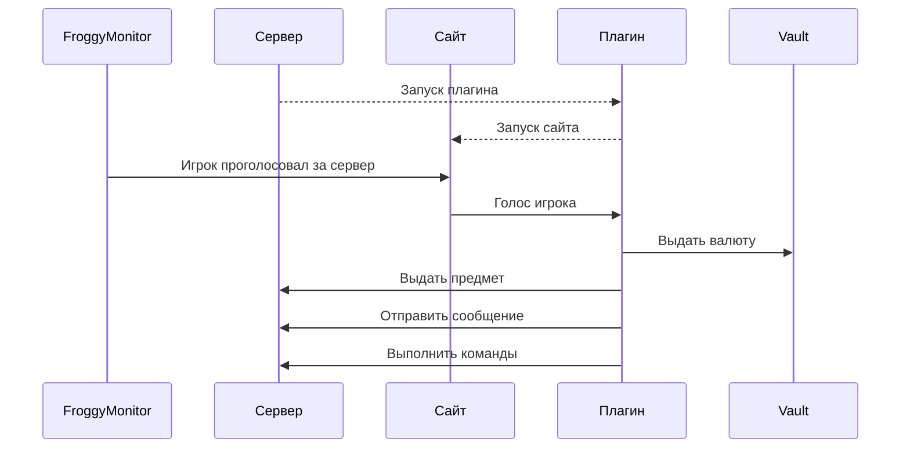

# FroggyMonitorReward
Плагин для награды игроков за голоса и отзывы на FroggyMonitor
Он сам изменяет URL'ы для поощрения на мониторинге, самим не надо ничего делать
Поддерживает PlaceholderAPI и Vault

[Скачать](https://github.com/MeexReay/FroggyMonitorReward/releases/latest)

## Конфиг
```yml
bind_host: 0.0.0.0    # Локальный IP адрес сервера (обычно такой же как и в server.properties)
bind_port: 8080       # Свободный порт для сайта (потребуется открыть его на хостинге)

external_host: example.com   # Внешний IP адрес / домен сервера

secret_token: "ваш_секретный_токен" # Секретный токен с FroggyMonitor

vote:                   # Награда за голос
  vault: 10                     # Выдать валюту
  item: "diamond 10"            # Выдать предмет (забрать предмет нельзя)
  message: "Спасибо за голос!"  # Отправить сообщение
  commands:                     # Исполнить команды
    - "/title {player_name} subtitle на FroggyMonitor"
    - "/title {player_name} title Спасибо за отзыв!"
  # Каждый параметр наград не обязателен

add_comment:        # Награда за удаление отзыва
  vault: 10
  message: "Спасибо за отзыв!"

del_comment:        # Награда за удаление отзыва
  vault: -10                    # Снять валюту

enable_logs: true    # Включить логи плагина (true/false); true - вкл; false - выкл

message_formatting: "ampersand" # Изменить тип форматирования сообщений
  # Типы форматирования:
    # ampersand:    &cСообщение
    # section:      §cСообщение
    # minimessage:  <red>Сообщение</red>
    # json:         {"text": "Сообщение", "color": "red"}
```

## Как это работает


